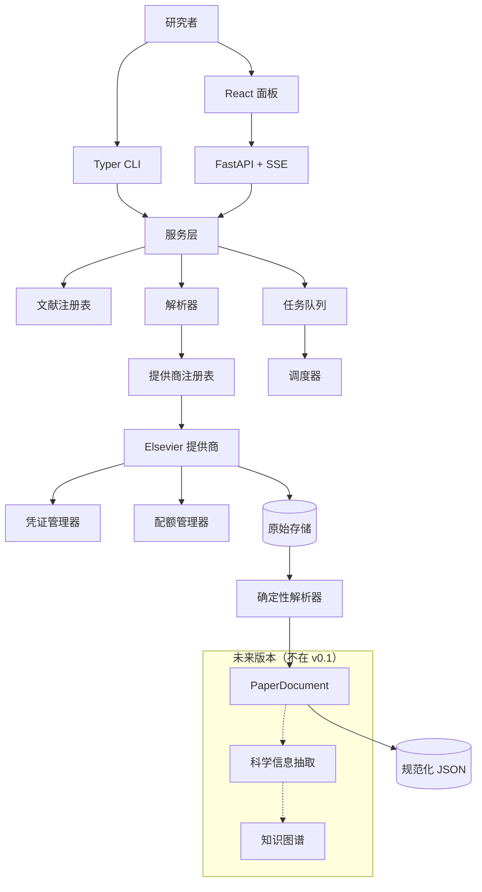

<div align="center">

# Literature Harvester 文献采集器

**本地优先的学术文献发现、获取、原始数据保存与确定性规范化工具。**

[English](README.md) · [简体中文](README-ZH.md)

> ## 🚀 第一次使用这个项目？从这里开始
>
> **[➡️ 阅读快速开始指南（简体中文）](QUICKSTART.md#简体中文)**
>
> 这份指南是写给**从没用过本工具、也不会写代码**的人的。它完整演示两种使用方式——
> **网页面板**和**命令行**，并且包含**无需任何 API Key 的离线演示模式**。
>
> 本 README 的其余部分属于进阶参考。

---


[](https://github.com/JohnResse1/lit-harvest/actions/workflows/ci.yml)
[](LICENSE)
[](https://www.python.org/)
[](tests)
[](https://github.com/astral-sh/ruff)
[](https://mypy-lang.org/)
[](pyproject.toml)
[](#设计原则)
[](SECURITY.md)

</div>

---

Literature Harvester 面向需要**可复现、尊重访问权限的文献流水线**的研究者。它可以检索论文、
导入 DOI 列表、通过官方 API 获取出版商全文、保存原始数据，并规范化为与提供商无关的统一文档
模型。

> **v0.1 范围** — 只做文献获取与结构化语料库。科学 LLM 抽取、实体/关系抽取和知识图谱均明确
> 不在本版本范围内。

---

## 目录

- [为什么做这个](#为什么做这个)
- [功能](#功能)
- [架构](#架构)
- [环境要求](#环境要求)
- [快速开始](#快速开始)
- [常用流程](#常用流程)
- [CLI 命令](#cli-命令)
- [配置](#配置)
- [凭证与配额](#凭证与配额)
- [存储结构](#存储结构)
- [本地 API](#本地-api)
- [Web 面板](#web-面板)
- [安全](#安全)
- [路径与可移植性](#路径与可移植性)
- [开发](#开发)
- [文档](#文档)
- [范围与路线图](#范围与路线图)
- [许可证](#许可证)

---

## 为什么做这个

大多数文献工具把三个完全不同的关注点混在一起：

```text
1. 获取文档      → 网络、访问权限、配额、重试
2. 理解结构      → 对出版商数据的确定性解析
3. 科学解释      → LLM 抽取、关系、假设
```

Literature Harvester 只构建**前两层**，并让它们保持解耦，以便后续加入第三层时无需重新下载
任何一篇论文。

## 设计原则

| 原则 | 含义 |
| --- | --- |
| **本地优先** | 默认绑定 `127.0.0.1`；所有状态、原始数据和密钥都保存在本机。 |
| **内部感知提供商** | Elsevier 是第一个提供商，但工作流只依赖提供商接口。 |
| **原始数据不可丢失** | 出版商响应按字节保存，解析器升级时也不丢弃。 |
| **不规避配额** | 凭证故障转移只在相互独立授权的凭证之间进行。 |
| **只用官方 API** | 不抓取、不做 OCR、不绕过出版商访问控制。 |

## 功能

| 模块 | 能力 |
| --- | --- |
| **发现** | Scopus Search `STANDARD`、游标分页、原始 JSON 保存 |
| **全文** | ScienceDirect `FULL` XML 获取 |
| **PDF** | 可选下载出版商 PDF，作为原始附件保存 |
| **导入** | CSV、TSV、TXT、JSON、JSONL DOI 导入，自动规范化与去重 |
| **规范化** | FULL XML → `PaperDocument`（章节、图、表、参考文献） |
| **调度** | 持久化 SQLite 任务队列，支持重试、恢复、`waiting_for_quota` |
| **配额** | 提供商 → 服务 → 凭证 三级跟踪，解析响应头并维护本地估算 |
| **凭证** | 项目内 `0600` 密钥文件、可选系统 Keyring、兼容环境变量 |
| **CLI** | `doctor`、`search`、`fetch`、`parse`、`auth`、`security`、`ui` 等 |
| **面板** | React + FastAPI，**中英文双语**，SSE 实时更新 |
| **安全** | 内置 API 泄漏扫描，CI 强制检查 |

## 架构



**边界：** CLI 和 FastAPI 调用同一个服务层。提供商特有逻辑不会泄漏到路由、CLI 命令或前端。

## 环境要求

- **Python 3.11+**
- 与你账号/机构权限匹配的 **Elsevier API Key**
- 只有从源码构建前端时才需要 **Node.js**

## 快速开始

### 1. 安装

```bash
git clone https://github.com/JohnResse1/lit-harvest.git
cd lit-harvest

# 创建并激活隔离环境
python3 -m venv .venv
source .venv/bin/activate          # macOS / Linux
.venv\Scripts\Activate.ps1        # Windows PowerShell

# 从当前文件夹安装
python -m pip install -e .

cp config.example.yaml config.yaml
```

> **不熟悉终端操作？** 请先看 **[QUICKSTART.md](QUICKSTART.md)**。里面手把手教你怎么安装
> Python 和 Git、怎么找到项目文件夹，并给出了三个系统各自的命令。

> 激活环境是让 `lit-harvest` 在三个平台都能直接使用的原因。如果提示
> `command not found: lit-harvest`，说明你忘了激活。

### 2. 保存 Elsevier 凭证
首先需要主动申请Elsevier的API，网址如下

```http
https://dev.elsevier.com
```

密钥保存在项目内部，不需要 `export` 环境变量：

```bash
.venv/bin/lit-harvest auth set elsevier university_primary
```

```text
API key for elsevier/university_primary:
```

| 项目 | 值 |
| --- | --- |
| 位置 | `<项目目录>/.lit-harvest/secrets.json` |
| 权限 | `0600` |
| Git | 已被 `.gitignore` 忽略 |
| 不会写入 | `config.yaml`、SQLite、日志、API 响应、浏览器 |

`config.yaml` 只保存引用：

```yaml
providers:
  elsevier:
    credentials:
      - name: university_primary
        secret_ref: file:elsevier:university_primary
        institution: YOUR_INSTITUTION
        quota_scope: institution
```

### 3. 检查环境

```bash
.venv/bin/lit-harvest auth list
.venv/bin/lit-harvest doctor
.venv/bin/lit-harvest doctor --network
```

缺少必要凭证时 `doctor` 会返回非零退出码，这是设计行为。

## 常用流程

### 按主题检索（下载前先预览）

检索**只会预览**结果，不会自动下载全文。你会得到一个候选表格和 session id：

```bash
.venv/bin/lit-harvest search \
  --query 'TITLE-ABS-KEY("solid-state battery")' \
  --max-results 20
```

然后可以下载该次检索的全部结果：

```bash
.venv/bin/lit-harvest fetch-session SESSION_ID
```

或者在网页面板中逐条勾选——每行都有勾选框，显示哪些元数据列也可以自行配置。

### 获取单个 DOI

```bash
.venv/bin/lit-harvest fetch 10.1016/j.mtcomm.2026.115551
```

### 同时获取 XML 和出版商 PDF

```bash
.venv/bin/lit-harvest fetch 10.1016/j.mtcomm.2026.115551 --pdf
```

PDF 是补充性原始附件，FULL XML 仍是规范化的权威来源。如果没有 PDF 权限，XML 仍会成功，
JSON 结果中会包含 `pdf_error` 字段。

让每次 fetch 都尝试下载 PDF：

```yaml
providers:
  elsevier:
    download_pdf: true
```

### 导入 DOI 文件（命令行）

```bash
.venv/bin/lit-harvest fetch papers.csv --doi-column doi
```

#### CSV 最少需要什么

CSV **必须有表头行**，并且至少有一列是你指定的 DOI 列（默认列名 `doi`）。只有 DOI 列是必需的，
其他列会被忽略。

```csv
doi
10.1016/j.mtcomm.2026.115551
```

| 要求 | 说明 |
| --- | --- |
| 表头行 | **必需。** 没有表头会报 `Column 'doi' not found`。 |
| DOI 列 | 默认列名 `doi`，可在「DOI 列名」修改或使用 `--doi-column`。 |
| 其他列 | 可选。`title`、`notes` 等导入时会被忽略。 |
| 编码 | UTF-8，带不带 BOM 均可。 |
| 分隔符 | `.csv` 用逗号，`.tsv` 用 Tab；`.txt` 每行一个 DOI。 |
| 重复 DOI | 自动去重，保留首次出现顺序。 |
| 无效行 | 逐行报告，不会中断整批。 |
| 支持的 DOI 写法 | 裸 DOI、`https://doi.org/...`、`http://dx.doi.org/...`、`doi:...`、`DOI: ...` |

如果你的文件没有表头，可以改存为 `.txt`（每行一个 DOI），或者手动加上 `doi` 表头。

### 导入 DOI 文件（网页版）

打开 `http://127.0.0.1:8765/papers`，使用「**从文件批量导入**」面板：

1. 选择 `.csv`、`.tsv`、`.txt`、`.json` 或 `.jsonl` 文件
2. 设置「**DOI 列名**」（默认 `doi`）
3. 保持勾选「**立即执行**」即可排队并真正下载
4. 勾选「**同时下载出版商 PDF**」可一并保存 PDF

面板内可直接下载示例文件：
[`examples/dois.sample.csv`](examples/dois.sample.csv)

```csv
doi,title,notes
10.1016/j.mtcomm.2026.115551,Information extraction for materials science,示例
https://doi.org/10.1016/j.jpowsour.2026.100001,Solid-state battery interfaces,URL 形式
doi:10.1016/j.nanoen.2026.100002,Nanostructured electrolytes,带 doi 前缀
```

### 导入 DOI 文件（本地接口）

```bash
curl -X POST 'http://127.0.0.1:8765/api/papers/import?doi_column=doi&run_now=true&download_pdf=false' \
  -F 'file=@examples/dois.sample.csv;type=text/csv'
```

返回结果会明确报告执行情况：

```json
{
  "queued": 4,
  "duplicates": 0,
  "invalid": [],
  "paper_ids": ["...", "..."],
  "run": {"attempted": 4, "succeeded": 4, "failed": 0, "waiting_for_quota": 0}
}
```

```text
.csv  .tsv  .txt  .json  .jsonl
```

以下 DOI 写法会自动规范化并去重：

```text
10.1016/j.xxx
https://doi.org/10.1016/j.xxx
http://dx.doi.org/10.1016/j.xxx
doi:10.1016/j.xxx
DOI: 10.1016/j.xxx
```

### 重新规范化已下载的原始 XML

```bash
.venv/bin/lit-harvest parse          # 仅处理尚未解析的论文
.venv/bin/lit-harvest parse --force  # 解析器升级后全部重新解析
```

不会重新下载。

### 启动面板

```bash
.venv/bin/lit-harvest ui
```

```text
http://127.0.0.1:8765
http://127.0.0.1:8765/docs
```

## CLI 命令

```text
lit-harvest version
lit-harvest demo [--reset] [--clear]
lit-harvest storage show
lit-harvest storage set PATH [--migrate/--no-migrate] [--overwrite]
lit-harvest storage reset [--migrate/--no-migrate]
lit-harvest doctor  [--network] [--json] [--config PATH]

lit-harvest auth set    [provider] [name] [--secret-ref REF] [--config PATH]
lit-harvest auth list   [--config PATH]
lit-harvest auth test   [provider] [name] [--config PATH]
lit-harvest auth remove [provider] [name] [--secret-ref REF] [--config PATH]

lit-harvest search --query QUERY --max-results N
                   [--start-year N] [--end-year N] [--export PATH]
                   [--download-session SESSION_ID] [--config PATH]
lit-harvest fetch-session SESSION_ID [--pdf] [--config PATH]

lit-harvest fetch DOI|FILE [--doi-column COLUMN] [--pdf|--no-pdf] [--config PATH]
lit-harvest parse [--limit N] [--force] [--config PATH]
lit-harvest export PATH [--format csv|json|jsonl] [--config PATH]
lit-harvest jobs [--status STATUS] [--limit N] [--config PATH]
lit-harvest quota [--config PATH]
lit-harvest pause [--reason TEXT] [--config PATH]
lit-harvest resume [--config PATH]
lit-harvest retry --job-id ID | --transient [--config PATH]
lit-harvest security scan [ROOT] [--json]
lit-harvest worker [--once] [--poll-interval S] [--max-jobs N] [--config PATH]
lit-harvest ui [--host HOST] [--port PORT] [--config PATH]
```

## 配置

从 [`config.example.yaml`](config.example.yaml) 开始。

```yaml
storage:
  root: ./data

database:
  url: sqlite:///./data/lit_harvest.db

scheduler:
  retry:
    max_attempts: 4
    base_delay_seconds: 2
  rate_limit:
    respect_retry_after: true
  quota:
    warning_ratio: 0.30
    low_ratio: 0.10

server:
  host: 127.0.0.1
  port: 8765

providers:
  elsevier:
    enabled: true
    download_pdf: false
    services:
      scopus_search:
        enabled: true
      article_retrieval:
        enabled: true
      article_pdf:
        enabled: true
    credentials:
      - name: university_primary
        secret_ref: file:elsevier:university_primary
        institution: YOUR_INSTITUTION
        quota_scope: institution
```

### 凭证引用格式

| 引用 | 后端 | 推荐 |
| --- | --- | --- |
| `file:provider:name` | 项目内 `0600` 密钥文件 | ✅ 默认 |
| `keychain:service:account` | macOS Keychain / 系统 Keyring | 可选 |
| `env:NAME` | 环境变量 | 仅 CI/容器 |

旧的 `api_key_env` 字段仍兼容，但不再推荐用于本地。

## 每人一个本地实例

仓库里**只有代码**。每个人 clone 后得到自己独立的空实例，任何人的论文、配额和密钥都不会被
其他人看到。

```text
GitHub 仓库（只有代码）
        │  git clone
        ▼
你的机器 ──► ./.lit-harvest/secrets.json    你自己的 API Key
         ──► ./data/lit_harvest.db          你自己的文献、配额、任务
         ──► ./data/papers/                 你自己的原始 XML 和 PDF
```

| 保证 | 实现方式 |
| --- | --- |
| 数据不共享 | `data/`、`.lit-harvest/`、`config.yaml` 被 Git 忽略，从不提交 |
| 密钥不共享 | 每个人执行 `lit-harvest auth set`，密钥只存在本机 |
| 无法远程访问 | 看板只绑定 `127.0.0.1`；非本机绑定会被**拒绝** |
| 不跨机器可见 | 不向任何服务器上传数据，没有服务端组件 |
| 可自行验证 | `lit-harvest ui` 会打印用户名、主机名和实例 ID；`/api/instance` 可查询 |

`lit-harvest ui` 拒绝在公网接口启动：

```text
Refusing to bind to 0.0.0.0: this dashboard has no authentication and would be
readable by anyone who can reach the port.
```

只有在你自己加了认证或可信反向代理时才覆盖：

```yaml
server:
  allow_non_loopback: false   # 除非完全理解暴露风险，否则保持 false
```

分享这个项目 = 分享**工具**，而不是分享语料库。

## 凭证与配额

配额状态按 **提供商 → 服务 → 凭证** 三级跟踪，并持久化在 SQLite 中。

```text
凭证故障转移策略:
  机构级配额耗尽  → 阻止同一机构下的其他凭证轮换
  账号级配额耗尽  → 阻止轮换
  提供商级耗尽    → 阻止轮换
  范围未知        → 保守处理：阻止轮换
  凭证级独立配额  → 允许合法故障转移
```

| HTTP 状态 | 行为 |
| --- | --- |
| `429` | 读取 `Retry-After`，标记冷却，转为 `waiting_for_quota` |
| `500/502/503/504` | 有上限的指数退避 |
| 超时 / 网络错误 | 有上限的指数退避 |
| `401` | 标记凭证不健康 |
| `403` | 标记服务 `degraded`；**不会**禁用凭证 |
| `400/404` | 永久失败，不无限重试 |

> 绝不通过轮换凭证绕过提供商或机构配额。

## 存储结构

```text
data/
├── lit_harvest.db
├── exports/
└── papers/
    └── 10.1016_j.example/
        ├── raw/
        │   ├── elsevier_xml.xml
        │   └── elsevier_pdf.pdf        # 可选
        ├── normalized/
        │   └── paper.json
        └── state.json
```

项目内密钥单独保存，并被 Git 忽略：

```text
.lit-harvest/
└── secrets.json       # 权限 0600
```

## 本地 API

```text
GET  /api/health
GET  /api/overview
GET  /api/doctor

GET  /api/papers
POST /api/papers/import
POST /api/papers/doi
GET  /api/papers/export
GET  /api/papers/{paper_id}
GET  /api/papers/{paper_id}/download/xml|pdf|normalized
POST /api/papers/download/zip
GET  /api/papers/import/sample.csv

POST /api/search
GET  /api/search
GET  /api/search/sessions
GET  /api/search/sessions/{session_id}
POST /api/search/sessions/{session_id}/select
POST /api/search/sessions/{session_id}/download

GET  /api/settings/storage
GET  /api/settings/storage/validate
POST /api/settings/storage
POST /api/settings/storage/reset

GET  /api/worker
POST /api/worker/tick

GET  /api/providers
GET  /api/providers/quotas

GET  /api/jobs
POST /api/jobs/{job_id}/retry
POST /api/jobs/{job_id}/cancel
GET  /api/failures
POST /api/failures/retry-transient

POST /api/queue/pause
POST /api/queue/resume

GET  /api/events          # Server-Sent Events
```

## Web 面板

| 路由 | English | 中文 |
| --- | --- | --- |
| `/` | Overview | 总览 |
| `/papers` | Papers | 文献 |
| `/providers` | Providers & quotas | 提供商与配额 |
| `/failures` | Failure center | 失败任务 |
| `/storage` | Storage location | 存储目录 |

文献页面还提供：

| 控件 | 作用 |
| --- | --- |
| 添加 DOI | 排队并立即获取单个 DOI，可选同时下载 PDF |
| 检索 Scopus | 在浏览器中执行发现检索 |
| 打包下载全部数据（ZIP） | 打包 XML、PDF、规范化 JSON 和 state |
| 导出 CSV | 下载文献注册表 |
| 单篇按钮 | 下载 XML、PDF 或规范化 JSON |

`lit-harvest ui` 启动时会自动运行后台 worker，因此面板中的暂停/恢复/重试会真正执行队列任务。
也可以独立运行：

```bash
lit-harvest worker
lit-harvest worker --once
```

面板会根据浏览器语言自动选择，并可通过 **中文 / EN** 控件运行时切换。所有操作都调用与 CLI
相同的后端服务层。

## 安全

```bash
lit-harvest security scan
```

扫描 Git 跟踪和可见文件中的疑似 API Key、私钥块；如果 `.lit-harvest/`、`config.yaml`、
`data/`、`.env` 等受保护路径被 Git 跟踪，会直接失败。CI 中强制执行。

详见 [SECURITY.md](SECURITY.md)。如果发生真实密钥泄漏，请先撤销密钥，不要开公开 Issue。

## 使用限速

出版社的 API 访问是**按机构**计量的，不是按个人。一个客户端跑得太猛，可能拖慢甚至封禁同一所大学
所有研究者的访问。因此本工具内置了温和的默认节奏和每日上限。

```bash
lit-harvest policy show
```

```text
Provider | Service   | Used today | Daily cap | Min interval
elsevier | Full text |          0 |       100 | 60s
elsevier | PDF       |          0 |        50 | 120s
elsevier | Search    |          2 |       200 | 5s
```

| 控制项 | 默认值 | 原因 |
| --- | --- | --- |
| 全文间隔 | 60 秒 | 让批量任务跑一整夜，而不是瞬时爆发 |
| PDF 间隔 | 120 秒 | PDF 体积更大，对出版社压力更高 |
| 检索间隔 | 5 秒 | 检索较轻，但同样计量 |
| 全文每日上限 | 100 | 远高于正常研究工作量 |
| PDF 每日上限 | 50 | 比 XML 更保守 |
| 检索每日上限 | 200 | 约等于 5000 条元数据 |
| 随机抖动 | ±25% | 避免固定、机械的请求节奏 |

默认值刻意保守。只有当图书馆或出版社给你**书面授权**后，才应该调高。

```yaml
providers:
  entries:
    elsevier:
      policy:
        fulltext_daily_limit: 200     # 有意识地调高
        fulltext_min_interval_seconds: 30
        unlimited: false              # 需要明确授权
```

> **设置 `unlimited: true` 等于声明你持有书面授权。** 出版社保留监控用量和模式、
> 并在怀疑未授权使用时暂停访问的权利。

## 存储目录

默认数据保存在 `./data`，也可以指向任意位置，包括移动硬盘。

**网页端：** 打开「**存储 / Storage**」页面，输入文件夹后点击「**使用此目录并复制数据**」。
已有文献和数据库会被复制过去，原目录保留作为备份。

**命令行：**

```bash
lit-harvest storage show                      # 当前存储位置
lit-harvest storage set ~/lit-harvest-data    # 更改目录并复制现有数据
lit-harvest storage set /mnt/big --no-migrate # 只切换，不复制
lit-harvest storage reset                     # 恢复默认 ./data
```

该设置保存在 `.lit-harvest/settings.json`（Git 忽略，权限 `0600`），对命令行和网页端同时生效。
修改后需要重启工具。

## 路径与可移植性

所有运行时路径相对于当前配置文件或当前工作目录解析：

```text
./data
./data/lit_harvest.db
./.lit-harvest/secrets.json
```

不依赖任何固定绝对路径。可以用 `LIT_HARVEST_CONFIG` 指向仓库外的配置文件，或在 `config.yaml`
中覆盖位置：

```yaml
storage:
  root: ~/lit-harvest-data
database:
  url: sqlite:///~/lit-harvest-data/lit_harvest.db
```

## 开发

```bash
.venv/bin/pytest                        # 114 个测试
.venv/bin/ruff check src/lit_harvest tests
.venv/bin/mypy src/lit_harvest
.venv/bin/lit-harvest security scan
```

重新构建双语前端：

```bash
./scripts/build_frontend.sh
```

| 检查项 | 状态 |
| --- | --- |
| 测试 | 114 个通过 |
| Lint | Ruff 通过 |
| 类型 | mypy strict，50 个文件 |
| 安全 | 仓库扫描通过 |

## 文档

| 文档 | 内容 |
| --- | --- |
| [**快速开始**](QUICKSTART.md) | **新手从这里开始 —— 网页端 + 命令行** |
| [架构](docs/ARCHITECTURE.md) | 分层、边界、数据流 |
| [数据模型](docs/DATA_MODEL.md) | 核心实体与 SQLite schema |
| [本地 API](docs/API.md) | 端点与 UI 路由 |
| [运维说明](docs/OPERATIONS.md) | 凭证、配额、恢复、存储 |
| [发布指南](docs/PUBLISHING.md) | 私密仓库 → 公开仓库检查清单 |
| [English README](README.md) | 英文说明 |

## 范围与路线图

**v0.1 已实现**

- 提供商抽象 · 凭证管理 · 配额管理
- 持久化调度器 · SQLite 状态 · 原始存储 · DOI 导入
- Scopus Search `STANDARD` · ScienceDirect `FULL` XML · 可选 PDF 附件
- Elsevier FULL XML 确定性规范化
- Typer CLI · FastAPI · 双语 React 面板 · SSE
- 暂停 / 恢复 / 重试 / 取消 · API 泄漏扫描 · CI

**后续规划**

| 版本 | 重点 |
| --- | --- |
| `v0.2` | OpenAlex、Crossref、Unpaywall 元数据/开放获取补充 |
| `v0.3` | Springer Nature、Wiley、ACS、RSC（需先确认官方 API 与许可） |
| `v0.4+` | 科学信息抽取 → 知识图谱 → 研究态势分析 |

**v0.1 明确不做**

LLM 抽取 · 材料 NER · 关系抽取 · 知识图谱 · Neo4j · 向量数据库 · 研究空白引擎 · 假设生成 ·
PDF OCR · 浏览器抓取 · 云部署 · SaaS · 登录系统 · UI 内密钥编辑 · 无限制密钥轮换 ·
大量出版商集成。

## 贡献

欢迎贡献，请先阅读 [CONTRIBUTING.md](CONTRIBUTING.md) 和
[CODE_OF_CONDUCT.md](CODE_OF_CONDUCT.md)，并在提交 PR 前运行完整检查。

## 许可证

[MIT](LICENSE) © 2026 Literature Harvester contributors
