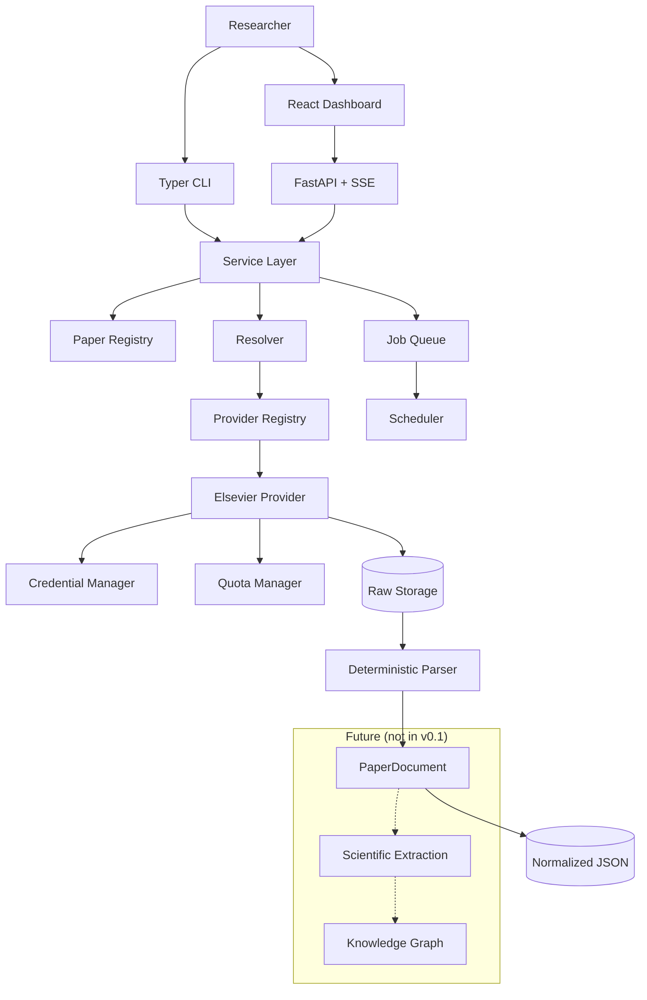

<div align="center">

# Literature Harvester

**Local-first academic literature discovery, acquisition, preservation, and deterministic normalization.**

[English](README.md) · [简体中文](README-ZH.md)

> ## 🚀 New to this project? Start here
>
> **[➡️ Read the Quick Start guide (English)](QUICKSTART.md)**
>
> It is written for people who have **never used this tool and do not write code**. It walks you
> through both ways of using Literature Harvester — the **web dashboard** and the **command line** —
> and includes an **offline demo mode** that works **without any API key**.
>
> Everything else in this README is a reference for advanced users.

---


[](https://github.com/JohnResse1/lit-harvest/actions/workflows/ci.yml)
[](LICENSE)
[](https://www.python.org/)
[](tests)
[](https://github.com/astral-sh/ruff)
[](https://mypy-lang.org/)
[](pyproject.toml)
[](#design-principles)
[](SECURITY.md)

</div>

---

Literature Harvester is a local-first toolkit for researchers who need a **reproducible,
entitlement-respecting literature pipeline**. It discovers papers, imports DOI lists, retrieves
publisher full text through official APIs, preserves raw data, and normalizes it into a
provider-independent document model.

> **v0.1 scope** — acquisition and structured corpus only. Scientific LLM extraction, entity/relation
> extraction, and knowledge graphs are deliberately out of scope.

---

## Table of Contents

- [Why This Exists](#why-this-exists)
- [Features](#features)
- [Architecture](#architecture)
- [Requirements](#requirements)
- [Quick Start](#quick-start)
- [Common Workflows](#common-workflows)
- [CLI Reference](#cli-reference)
- [Configuration](#configuration)
- [Credentials & Quotas](#credentials--quotas)
- [Storage Layout](#storage-layout)
- [Local API](#local-api)
- [Web Dashboard](#web-dashboard)
- [Security](#security)
- [Portability](#portability)
- [Development](#development)
- [Documentation](#documentation)
- [Scope & Roadmap](#scope--roadmap)
- [License](#license)

---

## Why This Exists

Most literature tooling mixes three very different concerns:

```text
1. Acquiring documents      → network, entitlements, quotas, retries
2. Understanding structure  → deterministic parsing of publisher data
3. Scientific interpretation → LLM extraction, relations, hypotheses
```

Literature Harvester deliberately builds **only the first two layers**, and keeps them decoupled so
the third can be added later without re-downloading a single article.

## Design Principles

| Principle | Meaning |
| --- | --- |
| **Local-first** | Binds to `127.0.0.1`; all state, raw data, and secrets stay on your machine. |
| **Provider-aware, user-agnostic** | Elsevier is the first provider, but the workflow talks to a provider interface. |
| **Raw data is sacred** | Publisher responses are stored byte-for-byte and never discarded when parsers evolve. |
| **No quota evasion** | Credential failover only happens across independently authorized credentials. |
| **Official APIs only** | No scraping, no OCR, no bypassing publisher access controls. |

## Features

| Area | Capability |
| --- | --- |
| **Discovery** | Scopus Search `STANDARD`, cursor pagination, raw JSON preserved |
| **Full text** | ScienceDirect `FULL` XML retrieval |
| **PDF** | Optional publisher PDF preserved as a raw attachment |
| **Import** | DOI lists from CSV, TSV, TXT, JSON, JSONL with normalization + dedup |
| **Normalization** | Deterministic FULL XML → `PaperDocument` (sections, figures, tables, references) |
| **Scheduling** | Persistent SQLite job queue with retry, resume, and `waiting_for_quota` |
| **Quotas** | Provider → service → credential tracking with header parsing and local estimates |
| **Credentials** | Project-local `0600` secret file, optional OS keyring, legacy env support |
| **CLI** | `doctor`, `search`, `fetch`, `parse`, `auth`, `security`, `ui`, `jobs`, `quota`, `retry` |
| **Dashboard** | React + FastAPI, **bilingual EN / 中文**, live updates over SSE |
| **Security** | Built-in secret-leak scanner enforced in CI |

## Architecture



**Boundaries:** CLI and FastAPI both call the same service layer. Provider-specific logic never leaks
into routes, CLI commands, or the frontend.

## Requirements

- **Python 3.11+**
- An **Elsevier API key** with the access your institution/account is authorized to use
- **Node.js** only if you rebuild the frontend from source

## Quick Start

### 1. Install

```bash
git clone https://github.com/JohnResse1/lit-harvest.git
cd lit-harvest

python3.11 -m venv .venv
.venv/bin/python -m pip install -e '.[dev]'
cp config.example.yaml config.yaml
```

### 2. Store your Elsevier credential
The pre-requisite is the official Elsevier API key, apply from

```http
https://dev.elsevier.com
```


Secrets stay inside the project — no shell environment variables required:

```bash
.venv/bin/lit-harvest auth set elsevier university_primary
```

```text
API key for elsevier/university_primary:
```

| Property | Value |
| --- | --- |
| Location | `<project>/.lit-harvest/secrets.json` |
| Permission | `0600` |
| Git | Ignored by `.gitignore` |
| Never written to | `config.yaml`, SQLite, logs, API responses, browser |

`config.yaml` stores only a reference:

```yaml
providers:
  elsevier:
    credentials:
      - name: university_primary
        secret_ref: file:elsevier:university_primary
        institution: YOUR_INSTITUTION
        quota_scope: institution
```

### 3. Verify

```bash
.venv/bin/lit-harvest auth list
.venv/bin/lit-harvest doctor
.venv/bin/lit-harvest doctor --network
```

`doctor` exits nonzero when required credentials are missing — by design.

## Common Workflows

### Search by topic

```bash
.venv/bin/lit-harvest search \
  --query 'TITLE-ABS-KEY("solid-state battery")' \
  --max-results 100
```

### Fetch one DOI

```bash
.venv/bin/lit-harvest fetch 10.1016/j.mtcomm.2026.115551
```

### Fetch XML + publisher PDF

```bash
.venv/bin/lit-harvest fetch 10.1016/j.mtcomm.2026.115551 --pdf
```

PDFs are supplementary raw attachments; FULL XML remains the canonical normalization source. If PDF
access is unavailable, XML still succeeds and the JSON result contains a `pdf_error` field.

Enable PDFs for every fetch:

```yaml
providers:
  elsevier:
    download_pdf: true
```

### Import a DOI file (CLI)

```bash
.venv/bin/lit-harvest fetch papers.csv --doi-column doi
```

#### Minimum CSV requirements

A CSV must have a **header row**, and at least one column whose name you pass as the DOI column
(`doi` by default). Only the DOI column is required — extra columns are ignored and kept as import
metadata.

```csv
doi
10.1016/j.mtcomm.2026.115551
```

| Requirement | Notes |
| --- | --- |
| Header row | **Required.** A headerless file raises `Column 'doi' not found`. |
| DOI column | Default name `doi`; change it with the **DOI column** field or `--doi-column`. |
| Extra columns | Optional. `title`, `notes`, etc. are ignored during import. |
| Encoding | UTF-8, with or without BOM. |
| Delimiter | `,` for `.csv`, tab for `.tsv`; `.txt` is one DOI per line. |
| Duplicates | Removed automatically; first occurrence wins. |
| Invalid rows | Reported per row and do not stop the batch. |
| Accepted DOI forms | Bare, `https://doi.org/...`, `http://dx.doi.org/...`, `doi:...`, `DOI: ...` |

If your file has no header, convert it to `.txt` (one DOI per line) or add a `doi` header.

### Import a DOI file (Web UI)

Open `http://127.0.0.1:8765/papers` and use the **Batch import from file** panel:

1. Choose a `.csv`, `.tsv`, `.txt`, `.json`, or `.jsonl` file.
2. Set the **DOI column** (default `doi`).
3. Keep **Run immediately** checked to queue *and* fetch.
4. Tick **Also download the publisher PDF** to attach PDFs too.

A ready-to-use sample is downloadable from the same panel:
[`examples/dois.sample.csv`](examples/dois.sample.csv)

```csv
doi,title,notes
10.1016/j.mtcomm.2026.115551,Information extraction for materials science,Example
https://doi.org/10.1016/j.jpowsour.2026.100001,Solid-state battery interfaces,URL form
doi:10.1016/j.nanoen.2026.100002,Nanostructured electrolytes,doi prefix
```

### Import a DOI file (local API)

```bash
curl -X POST 'http://127.0.0.1:8765/api/papers/import?doi_column=doi&run_now=true&download_pdf=false' \
  -F 'file=@examples/dois.sample.csv;type=text/csv'
```

The response reports exactly what happened:

```json
{
  "queued": 4,
  "duplicates": 0,
  "invalid": [],
  "paper_ids": ["...", "..."],
  "run": {"attempted": 4, "succeeded": 4, "failed": 0, "waiting_for_quota": 0},
  "pdf_succeeded": 0,
  "pdf_failed": 0
}
```

```text
.csv  .tsv  .txt  .json  .jsonl
```

These DOI forms are normalized and deduplicated:

```text
10.1016/j.xxx
https://doi.org/10.1016/j.xxx
http://dx.doi.org/10.1016/j.xxx
doi:10.1016/j.xxx
DOI: 10.1016/j.xxx
```

### Re-normalize downloaded raw XML

```bash
.venv/bin/lit-harvest parse          # only unparsed papers
.venv/bin/lit-harvest parse --force  # re-parse everything after a parser upgrade
```

No re-download is performed.

### Launch the dashboard

```bash
.venv/bin/lit-harvest ui
```

```text
http://127.0.0.1:8765
http://127.0.0.1:8765/docs
```

## CLI Reference

```text
lit-harvest version
lit-harvest demo [--reset] [--clear]
lit-harvest doctor  [--network] [--json] [--config PATH]

lit-harvest auth set    [provider] [name] [--secret-ref REF] [--config PATH]
lit-harvest auth list   [--config PATH]
lit-harvest auth test   [provider] [name] [--config PATH]
lit-harvest auth remove [provider] [name] [--secret-ref REF] [--config PATH]

lit-harvest search --query QUERY --max-results N
                   [--start-year N] [--end-year N] [--export PATH] [--config PATH]

lit-harvest fetch DOI|FILE [--doi-column COLUMN] [--pdf|--no-pdf] [--config PATH]
lit-harvest parse [--limit N] [--force] [--config PATH]
lit-harvest export PATH [--format csv|json|jsonl] [--config PATH]
lit-harvest jobs [--status STATUS] [--limit N] [--config PATH]
lit-harvest quota [--config PATH]
lit-harvest pause [--reason TEXT] [--config PATH]
lit-harvest resume [--config PATH]
lit-harvest retry --job-id ID | --transient [--config PATH]
lit-harvest security scan [ROOT] [--json]
lit-harvest worker [--once] [--poll-interval S] [--max-jobs N] [--config PATH]
lit-harvest ui [--host HOST] [--port PORT] [--config PATH]
```

## Configuration

Start from [`config.example.yaml`](config.example.yaml).

```yaml
storage:
  root: ./data

database:
  url: sqlite:///./data/lit_harvest.db

scheduler:
  retry:
    max_attempts: 4
    base_delay_seconds: 2
  rate_limit:
    respect_retry_after: true
  quota:
    warning_ratio: 0.30
    low_ratio: 0.10

server:
  host: 127.0.0.1
  port: 8765

providers:
  elsevier:
    enabled: true
    download_pdf: false
    services:
      scopus_search:
        enabled: true
      article_retrieval:
        enabled: true
      article_pdf:
        enabled: true
    credentials:
      - name: university_primary
        secret_ref: file:elsevier:university_primary
        institution: YOUR_INSTITUTION
        quota_scope: institution
```

### Secret reference formats

| Reference | Backend | Recommended |
| --- | --- | --- |
| `file:provider:name` | Project-local `0600` secret file | ✅ Default |
| `keychain:service:account` | macOS Keychain / OS keyring | Optional |
| `env:NAME` | Environment variable | CI/containers only |

The legacy `api_key_env` field remains supported but is not the recommended local workflow.

## One Instance Per Person

The repository contains **code only**. Every person who clones it gets their own empty local
instance, and no one can see anyone else's papers, quotas, or secrets.

```text
GitHub repo (code only)
        │  git clone
        ▼
Your machine ──► ./.lit-harvest/secrets.json    your API key
             ──► ./data/lit_harvest.db          your papers, quotas, jobs
             ──► ./data/papers/                 your raw XML and PDFs
```

| Guarantee | How it is enforced |
| --- | --- |
| No shared data | `data/`, `.lit-harvest/`, `config.yaml` are Git-ignored and never committed |
| No shared secrets | Each person runs `lit-harvest auth set` and stores their own key locally |
| No remote access | The dashboard binds `127.0.0.1` only; non-loopback binds are **refused** |
| No cross-machine visibility | Nothing is uploaded; there is no server component |
| Easy to verify | `lit-harvest ui` prints your user, hostname, and instance ID; `/api/instance` returns it |

`lit-harvest ui` refuses to start on a public interface:

```text
Refusing to bind to 0.0.0.0: this dashboard has no authentication and would be
readable by anyone who can reach the port.
```

Override only if you add your own authentication or trusted reverse proxy:

```yaml
server:
  allow_non_loopback: false   # keep false unless you fully understand the exposure
```

Sharing the project means sharing **the tool**, not the corpus.

## Credentials & Quotas

Quota state is tracked at **provider → service → credential** granularity and persisted in SQLite.

```text
Credential failover policy:
  institution exhausted  → block other credentials in the same institution
  account exhausted      → block rotation
  provider exhausted     → block rotation
  unknown scope          → conservative: block rotation
  credential scope       → independently authorized failover allowed
```

| HTTP | Behavior |
| --- | --- |
| `429` | Honor `Retry-After`, mark cooldown, defer as `waiting_for_quota` |
| `500/502/503/504` | Bounded exponential backoff |
| timeout / network | Bounded exponential backoff |
| `401` | Mark credential unhealthy |
| `403` | Mark service `degraded`; do **not** disable the credential |
| `400/404` | Permanent failure; no endless retry |

> Credential rotation is never used to circumvent provider or institutional quotas.

## Storage Layout

```text
data/
├── lit_harvest.db
├── exports/
└── papers/
    └── 10.1016_j.example/
        ├── raw/
        │   ├── elsevier_xml.xml
        │   └── elsevier_pdf.pdf        # optional
        ├── normalized/
        │   └── paper.json
        └── state.json
```

Project-local secrets live separately and are Git-ignored:

```text
.lit-harvest/
└── secrets.json       # mode 0600
```

## Local API

```text
GET  /api/health
GET  /api/overview
GET  /api/doctor

GET  /api/papers
POST /api/papers/import
POST /api/papers/doi
GET  /api/papers/export
GET  /api/papers/{paper_id}
GET  /api/papers/{paper_id}/download/xml|pdf|normalized
POST /api/papers/download/zip

POST /api/search
GET  /api/search

GET  /api/worker
POST /api/worker/tick

GET  /api/providers
GET  /api/providers/quotas

GET  /api/jobs
POST /api/jobs/{job_id}/retry
POST /api/jobs/{job_id}/cancel
GET  /api/failures
POST /api/failures/retry-transient

POST /api/queue/pause
POST /api/queue/resume

GET  /api/events          # Server-Sent Events
```

## Web Dashboard

| Route | English | 中文 |
| --- | --- | --- |
| `/` | Overview | 总览 |
| `/papers` | Papers | 文献 |
| `/papers/:id` | Paper detail | 文献详情 |
| `/providers` | Providers & quotas | 提供商与配额 |
| `/failures` | Failure center | 失败任务 |

The Papers page also exposes:

| Control | Purpose |
| --- | --- |
| Add a DOI | Queue and immediately fetch one DOI, optionally with PDF |
| Search Scopus | Run a discovery query from the browser |
| Download all data (ZIP) | Bundle XML, PDF, normalized JSON, and state |
| Export CSV | Download the paper registry |
| Per-paper buttons | Download XML, PDF, or normalized JSON |

The background worker starts automatically with `lit-harvest ui`, so pause/resume/retry from the
dashboard actually execute queued jobs. Run it headless with:

```bash
lit-harvest worker
lit-harvest worker --once
```

The dashboard follows your browser language and can be switched at runtime with the **中文 / EN**
control. All controls call the same backend service layer as the CLI.

## Security

```bash
lit-harvest security scan
```

Checks tracked and visible files for likely API keys and private-key blocks, and fails if a protected
path (`.lit-harvest/`, `config.yaml`, `data/`, `.env`) is tracked by Git. Enforced in CI.

See [SECURITY.md](SECURITY.md). Never open a public issue for an active credential leak — revoke the
key first.

## Portability

All runtime paths resolve relative to the active config file or the current working directory:

```text
./data
./data/lit_harvest.db
./.lit-harvest/secrets.json
```

No absolute paths are required. Use `LIT_HARVEST_CONFIG` to point at an external config, or override
locations in `config.yaml`:

```yaml
storage:
  root: ~/lit-harvest-data
database:
  url: sqlite:///~/lit-harvest-data/lit_harvest.db
```

## Development

```bash
.venv/bin/pytest                        # 59 tests
.venv/bin/ruff check src/lit_harvest tests
.venv/bin/mypy src/lit_harvest
.venv/bin/lit-harvest security scan
```

Rebuild the bilingual frontend:

```bash
./scripts/build_frontend.sh
```

| Check | Status |
| --- | --- |
| Tests | 59 passing |
| Lint | Ruff clean |
| Types | mypy strict, 50 files |
| Security | repository scan clean |

## Documentation

| Document | Contents |
| --- | --- |
| [**Quick Start**](QUICKSTART.md) | **Start here — for new users, web + CLI** |
| [Architecture](docs/ARCHITECTURE.md) | Layers, boundaries, data flow |
| [Data Model](docs/DATA_MODEL.md) | Core entities and SQLite schema |
| [Local API](docs/API.md) | Endpoints and UI routes |
| [Operations](docs/OPERATIONS.md) | Credentials, quotas, resume, storage |
| [Publishing](docs/PUBLISHING.md) | Private → public release checklist |
| [简体中文 README](README-ZH.md) | 中文说明 |

## Scope & Roadmap

**Implemented in v0.1**

- Provider abstraction · credential manager · quota manager
- Persistent scheduler · SQLite state · raw storage · DOI import
- Scopus Search `STANDARD` · ScienceDirect `FULL` XML · optional PDF attachment
- Deterministic FULL XML normalization
- Typer CLI · FastAPI · bilingual React dashboard · SSE
- Pause / resume / retry / cancel · secret-leak scanner · CI

**Planned**

| Version | Focus |
| --- | --- |
| `v0.2` | OpenAlex, Crossref, Unpaywall enrichment |
| `v0.3` | Springer Nature, Wiley, ACS, RSC (after official API/entitlement review) |
| `v0.4+` | Scientific extraction → knowledge graph → landscape analysis |

**Explicitly out of scope for v0.1**

LLM extraction · materials NER · relation extraction · knowledge graphs · Neo4j · vector databases ·
research-gap engine · hypothesis generation · PDF OCR · browser scraping · cloud deployment · SaaS ·
login · UI secret editing · unrestricted key rotation · broad multi-publisher integration.

## Contributing

Contributions are welcome — see [CONTRIBUTING.md](CONTRIBUTING.md) and
[CODE_OF_CONDUCT.md](CODE_OF_CONDUCT.md). Please run the full check suite before opening a PR.

## License

[MIT](LICENSE) © 2026 Literature Harvester contributors
